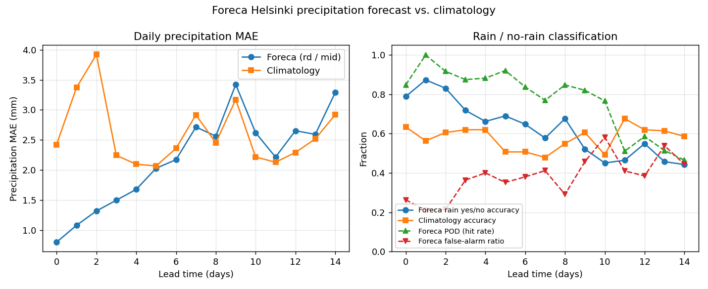

# Foreca 15-day forecast vs. reality — Helsinki

How good is Foreca's 15-day forecast for Helsinki, and would you do just as
well by looking up the historical average for that date? This is a small
study that tries to answer both questions with publicly available data.


## The problem

Foreca publishes a 15-day forecast for Helsinki at
`foreca.fi/Finland/Helsinki/15vrk`, but — like most forecast providers — it
does **not** expose an archive of past forecasts. If you want to know how
the day-10 forecast from 18 months ago compared to what actually happened,
you have to reconstruct it yourself.

## Approach

1. **Historical forecasts** are recovered from the
   [Internet Archive's Wayback Machine](https://web.archive.org/). The CDX
   API lists every archived copy of the 15-day page; for each snapshot we
   fetch the raw HTML and parse the JavaScript variable `longfc_data` (or
   the older `longfc`) that contains the 15-day forecast Foreca emitted at
   that point in time. We never contact `foreca.fi` directly.
2. **Observed weather** for Helsinki comes from the
   [Open-Meteo historical archive](https://open-meteo.com/en/docs/historical-weather-api)
   (daily Tmax, Tmin, and precipitation sum from ERA5 reanalysis at 60.17°N,
   24.94°E). No API key required.
3. **Climatology baseline** — the "what if you just used the historical
   average?" comparison — is built as an expanding-window day-of-year mean:
   for each target date D we average Tmax, Tmin, and precipitation from the
   same day-of-year (±3 days) across **all prior calendar years** in the
   observation record. This avoids leaking future information into the
   baseline.
4. **Errors** are computed per lead time (days 0–14 ahead): Foreca's point
   forecast is compared to the observation, and so is the climatology
   baseline, so we can read a skill score `1 − MAE_forecast / MAE_clim`.
5. **Probability intervals**: Foreca publishes two ranges per day in addition
   to the point forecast — a "50%" band and a "100%" band, for both Tmax and
   Tmin. We check empirically how often the observation actually fell inside
   each band.
6. **Precipitation** gets the same treatment: MAE of the point forecast vs
   MAE of climatology, rain/no-rain accuracy vs a climatological baseline,
   POD (hit rate), false-alarm ratio, CSI (threat score), and the coverage
   of the `[rl, rh]` range.

All HTTP responses are cached to `cache/` so reruns are free and we don't
hammer Wayback or Open-Meteo.

## What you get

Running `python3 foreca_15vrk.py` produces:

- `cache/forecasts.csv` — every parsed 15-day forecast, one row per
  (run_date, target_date) pair.
- `cache/observations.csv` — daily observed Tmax, Tmin, precipitation for
  Helsinki from 2010-01-01 to 2025-12-31.
- `cache/climatology.csv` — per-date expanding-window climatology.
- `cache/merged.csv` — all forecast rows joined to observations and
  climatology, with signed errors, interval-coverage flags, and
  rain/no-rain flags.
- `cache/summary_by_lead.csv`, `cache/interval_coverage.csv`,
  `cache/precipitation_by_lead.csv` — per-lead-time summary tables.
- `mae_vs_lead.png`, `skill_vs_lead.png`, `interval_coverage.png`,
  `interval_widths.png`, `precipitation.png` — plots.

## Findings

### Temperature point forecast


- At lead 0 (nowcast) the forecast has MAE ≈ 1.1–1.3 °C, versus ≈ 3.1 °C
  for a day-of-year climatology — a 60–67% reduction in error.
- Skill decays roughly linearly with lead time.
- **The break-even point is about day 9–10.** From day 10 on, the 15-day
  forecast's MAE is slightly *worse* than just using the historical average.
- The last ~5 days of the 15-day ribbon carry essentially no information
  beyond the climatological average.

### Probability intervals — are they calibrated?


Short answer: **no — they are severely under-dispersive at short lead**.

- At lead 0 the "50% band" contains the observed Tmax only **18%** of the
  time; the "100% band" catches it **55%** of the time.
- Coverage creeps up with lead time and reaches ≈ 0.85–0.95 for the 100%
  band from lead 4 onwards — but only because the bands widen dramatically:
  the Tmax 100% band grows from ~2 °C wide at lead 0 to ~12 °C wide at
  lead 14 (see `interval_widths.png`).
- Treat the bands as **ensemble spread**, not as calibrated probability
  intervals. The "100%" label does not mean the truth will fall inside.

### Precipitation



- **Useful out to ~4 days.** At leads 0–2, MAE is 0.8–1.3 mm versus
  2.4–3.9 mm for climatology (skill 0.66–0.68), and rain/no-rain accuracy
  is 79–87%.
- By lead 5 the mm-level skill has collapsed to ~0 (Foreca MAE 2.03 mm,
  climatology 2.07 mm).
- By lead 10 the forecast is *worse* than climatology: rain/no-rain
  accuracy drops to 45%, lower than the 49% you'd get by looking up the
  historical rain frequency for that day of year.
- The `[rl, rh]` range catches the observed precipitation ≈ 70–80% of the
  time at all lead lengths, so it is not a true full-range envelope.

### Rough useful-horizon cheat sheet

| Quantity | Useful horizon |
|---|---|
| Tmax / Tmin point forecast | ~9 days |
| Precipitation amount (mm) | ~4 days |
| Rain yes/no | ~2 days clearly, ~5 days weakly |
| Temperature bands as probability | Don't — they are ensemble spread, not calibrated intervals |

## Caveats

- **Small sample.** Only 71 parsed snapshots over 2016–2025 (Wayback doesn't
  crawl on a schedule), so per-lead n = 71 is on the low side. The numbers
  are directionally solid but noisy at the decimal level.
- **Observations are ERA5**, not the FMI Helsinki-Kaisaniemi station. City
  and reanalysis temperatures differ by a few tenths of a degree, which
  slightly inflates forecast MAE for free.
- **Snapshots are not a random sample** of Helsinki weather. The Wayback
  crawl is clumpy in time and may be biased toward newsworthy weather.
- **Only the point forecasts are compared for temperature.** The bands are
  only evaluated for coverage, not as a full probabilistic scoring rule.

## Running it

```bash
python3 foreca_15vrk.py
```

Requirements: `pandas`, `numpy`, `matplotlib`. Everything else is standard
library. First run fetches ~71 Wayback snapshots and one Open-Meteo query
serially with polite backoff; subsequent runs hit the disk cache and
complete in a few seconds.

## Files

- [foreca_15vrk.py](foreca_15vrk.py) — the whole pipeline in one file.
- `cache/` — HTTP response cache plus generated CSV tables.
- `*.png` — generated plots.

## Data sources

- Internet Archive — Wayback Machine ([CDX API](https://archive.org/developers/wayback-cdx-server.html))
- [Open-Meteo historical weather API](https://open-meteo.com/en/docs/historical-weather-api) (ERA5)
- Forecasts originate from [Foreca](https://www.foreca.fi/), recovered
  exclusively via the Wayback Machine.
